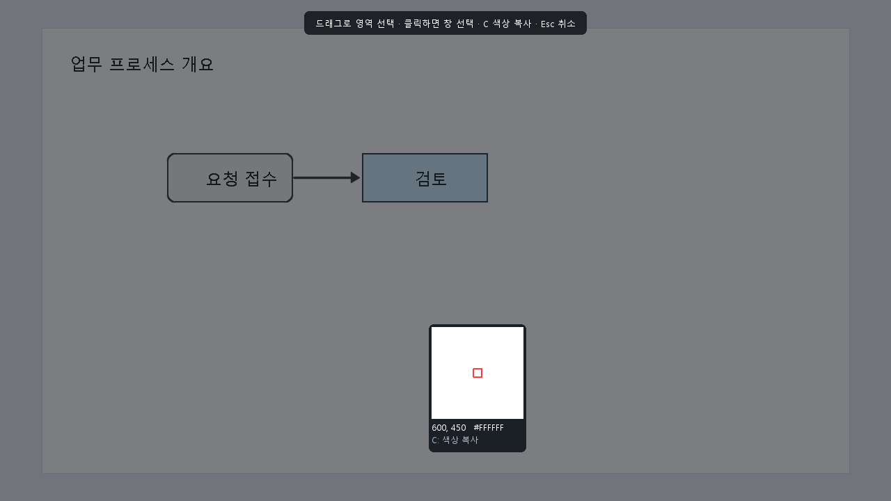
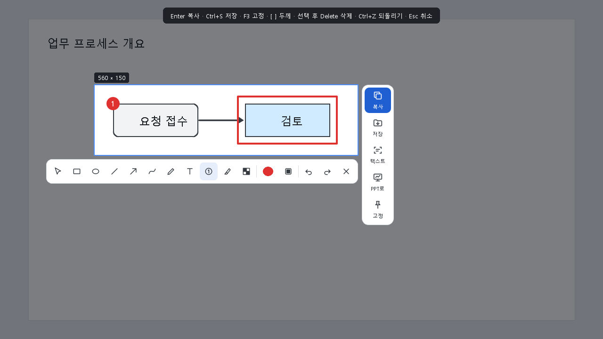
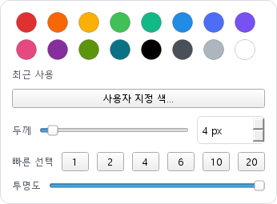
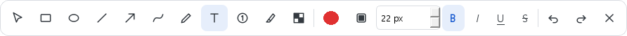
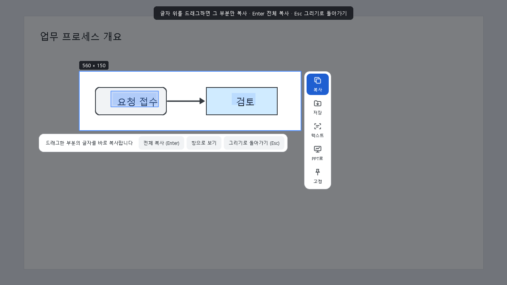
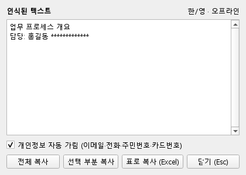
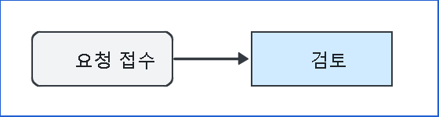
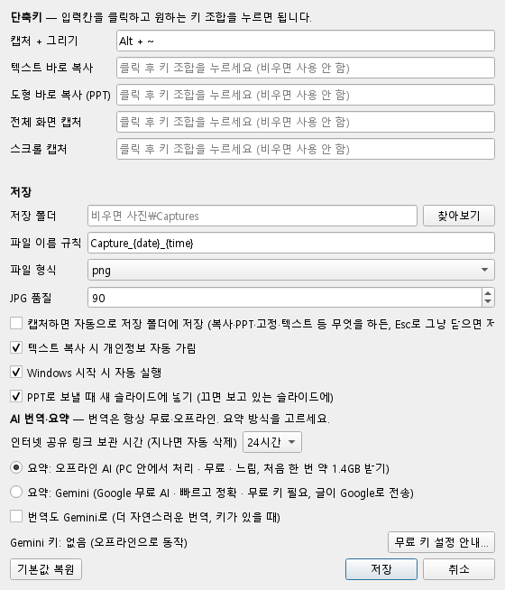

# 캡처 도구 사용 가이드 (처음 쓰는 분용)

이 문서는 컴퓨터에 익숙하지 않은 분도 따라 할 수 있도록 **다운로드 → 설치 → 사용 → 문제 해결 → 제거** 순서로 한 단계씩 설명합니다.
천천히 순서대로 따라 하시면 됩니다.

---

## 목차

1. [이 프로그램으로 할 수 있는 일](#1-이-프로그램으로-할-수-있는-일)
2. [준비물 확인](#2-준비물-확인)
3. [다운로드하기](#3-다운로드하기)
4. [설치하기](#4-설치하기)
5. [처음 실행 확인하기](#5-처음-실행-확인하기)
6. [기본 사용법: 캡처하고 붙여넣기](#6-기본-사용법-캡처하고-붙여넣기)
7. [그림 그리기 (빨간 상자, 화살표, 번호 등)](#7-그림-그리기)
8. [오른쪽 아이콘 5개 사용법](#8-오른쪽-아이콘-5개-사용법)
9. [단축키 바꾸기와 설정](#9-단축키-바꾸기와-설정)
10. [단축키 한눈에 보기](#10-단축키-한눈에-보기)
11. [문제가 생겼을 때](#11-문제가-생겼을-때)
12. [프로그램 지우기](#12-프로그램-지우기)

---

## 1. 이 프로그램으로 할 수 있는 일

- **Alt + ~** 키 한 번으로 화면을 캡처합니다.
- 캡처한 그림 위에 **빨간 상자, 동그라미, 화살표, 번호, 글자**를 바로 그립니다.
- 캡처한 그림을 **카카오톡, 메일, 한글, 워드, 파워포인트** 등 어디든 붙여넣습니다.
- 그림 속 **글자를 인식해서 복사**합니다. 인터넷이 없어도 됩니다.
  - 인식 언어: **한국어, 영어**, 그리고 **프랑스어·스페인어·독일어·이탈리아어·포르투갈어** 등 라틴 문자를 쓰는 언어(é, ç, ñ, ß, ¿ 같은 글자 포함). 언어를 고를 필요 없이 자동으로 알아봅니다.
  - 중국어, 일본어, 러시아어 등은 아직 지원하지 않습니다.
- 그림 속 **도형(네모, 동그라미, 화살표)을 파워포인트에서 고칠 수 있는 도형**으로 바꿔 넣습니다.
- 캡처한 그림을 **화면 위에 붙여 두고** 보면서 작업합니다.

모든 처리는 내 컴퓨터 안에서만 이루어집니다. 캡처한 그림이나 글자가 인터넷으로 전송되지 않습니다.

---

## 2. 준비물 확인

| 항목 | 필요 조건 |
|---|---|
| 운영체제 | Windows 10 또는 Windows 11 (64비트) |
| 저장 공간 | 약 350MB |
| 관리자 권한 | **필요 없음** (회사 PC에서도 설치 가능) |
| 따로 설치할 것 | **없음** (필요한 것이 모두 포함되어 있음) |
| 파워포인트 | "PPT로" 기능을 쓸 때만 필요 (Microsoft 365 권장) |

> **내 Windows 버전 확인 방법**: 키보드에서 `Windows 키 + R` → `winver` 입력 → Enter.
> "Windows 10" 또는 "Windows 11"이라고 나오면 됩니다.

---

## 3. 다운로드하기

1. 전달받은 GitHub 주소를 인터넷 브라우저(크롬, 엣지 등)로 엽니다.
   > 이 저장소는 **비공개**입니다. 관리자에게 초대받은 GitHub 계정으로 **로그인한 상태**여야 보입니다.
   > "404 페이지를 찾을 수 없음"이 뜨면 로그인이 안 됐거나 초대를 아직 수락하지 않은 것입니다. 메일함에서 GitHub 초대 메일을 확인하세요.
2. 화면 오른쪽의 **Releases**(릴리스)를 누릅니다.
3. 가장 위(최신 버전)에 있는 **Assets** 아래에서 `CaptureTool-Setup-버전.exe` 파일을 누릅니다.
4. 브라우저 아래쪽이나 오른쪽 위에 다운로드가 표시됩니다. 끝날 때까지 기다립니다(약 100MB).

> **"일반적으로 다운로드되지 않는 파일입니다"라는 경고가 뜨면** (엣지 브라우저)
> 파일 옆의 `…` → **유지** → **자세히 표시** → **그래도 계속**을 누릅니다.
> 새로 만든 프로그램이라 다운로드 수가 적어서 뜨는 안내이며, 파일에는 문제가 없습니다.

---

## 4. 설치하기

1. 다운로드한 `CaptureTool-Setup-버전.exe`를 **두 번 클릭**합니다.
2. **"Windows의 PC 보호"라는 파란 창이 뜨면**
   - **추가 정보**(작은 글씨)를 누릅니다.
   - 아래에 생기는 **실행** 버튼을 누릅니다.
   > 개인이 만든 무료 프로그램이라 아직 "디지털 서명"이 없어서 뜨는 안내입니다.
3. 설치 언어를 **한국어**로 두고 **확인**을 누릅니다.
4. 사용권 계약(MIT, 무료 사용 허가)을 읽고 **동의합니다** → **다음**을 누릅니다.
5. 추가 작업 선택 화면:
   - ✅ **Windows 시작 시 자동 실행**: 켜 두기를 권장합니다. 켜 두면 컴퓨터를 켤 때마다 단축키를 바로 쓸 수 있습니다.
   - ☐ **바탕 화면에 바로가기 만들기**: 원하면 선택합니다.
6. **설치**를 누르고, 끝나면 **"캡처 도구 실행"**에 체크된 상태로 **마침**을 누릅니다.

설치 위치는 `C:\Users\(내 이름)\AppData\Local\Programs\CaptureTool` 입니다. 따로 신경 쓰지 않아도 됩니다.

---

## 5. 처음 실행 확인하기

이 프로그램은 창이 따로 뜨지 않고, **화면 오른쪽 아래 작업 표시줄(시계 옆)에 아이콘으로 숨어서** 기다립니다.

1. 시계 왼쪽의 **∧ (위쪽 화살표)**를 누릅니다.
2. **파란 네모 안에 흰 모서리 모양** 아이콘이 보이면 실행 중입니다.
3. 처음 실행하면 "실행 중입니다. Alt + ~ 로 캡처하세요."라는 알림이 한 번 뜹니다.

> **아이콘을 항상 보이게 하려면**: ∧를 눌러 나온 아이콘을 작업 표시줄의 시계 옆으로 **끌어다 놓으세요**.

> **실행이 안 되어 있으면**: `Windows 키` → **캡처 도구** 입력 → 눌러서 실행합니다.

---

## 6. 기본 사용법: 캡처하고 붙여넣기

### 6-1. 캡처하기

1. 캡처하고 싶은 화면을 띄워 둡니다.
2. 키보드 왼쪽 아래의 **Alt 키를 누른 채로**, 숫자 1 왼쪽에 있는 **~ 키**를 누릅니다.
   - Mac 키보드를 쓰시면 **Option + ~** 입니다(같은 키입니다).
3. 화면이 **멈추고 살짝 어두워집니다**. 마우스가 있는 모니터가 먼저 멈춥니다.

4. 원하는 부분의 **왼쪽 위에서 마우스 왼쪽 버튼을 누른 채 오른쪽 아래로 끌었다가** 놓습니다.
   - **창 하나를 통째로** 잡고 싶으면, 끌지 말고 그 창 위에서 **한 번 클릭**하면 됩니다.
   - 마우스 옆의 작은 확대경은 커서 아래를 크게 보여 줍니다. 정확한 위치를 잡을 때 쓰세요.
   - 취소하려면 **Esc** 키를 누릅니다.

### 6-2. 붙여넣기

1. 영역을 고르면 아래에 **그리기 도구**, 오른쪽에 **아이콘 5개**가 나타납니다.
2. **Enter** 키(또는 오른쪽 파란 **복사** 아이콘)를 누릅니다.
3. 붙여넣을 곳(카카오톡 대화창, 메일 본문, 파워포인트 등)을 열고 **Ctrl + V** 를 누릅니다.

> 잘못 골랐다면? 영역을 고른 뒤에도 **방향키**로 1칸씩 옮길 수 있습니다(Shift+방향키는 10칸).

---

## 7. 그림 그리기

영역을 고르면 아래에 도구 막대가 뜹니다. 도구를 누르고 그림 위에서 **마우스로 끌면** 그려집니다.

| 도구 | 하는 일 | 바로 가는 키 |
|---|---|---|
| ↖ 선택 | 그린 것을 끌어서 옮김 | V |
| □ 사각형 | 강조 상자 (예: 빨간 상자) | R |
| ○ 타원 | 동그라미 | O |
| ╱ 직선 | 직선 | L |
| ↗ 화살표 | 가리키는 화살표 | A |
| ∿ 곡선 | 부드러운 곡선 | C |
| ✎ 펜 | 자유롭게 그리기 | P |
| T 텍스트 | 클릭한 자리에 글자 입력 → Enter | T |
| ① 번호 | 클릭할 때마다 ①②③ 자동 증가 | N |
| 형광펜 | 반투명 노란 강조 | H |
| 모자이크 | 개인정보 등을 흐리게 가림 | M |

- **색과 두께 바꾸기**: 도구 막대의 **동그란 색 버튼**을 누르면 팔레트가 열립니다.
  - 색: 16가지 기본 색, 최근에 쓴 색, **사용자 지정 색…**
  - 두께: 슬라이더를 끌거나 숫자를 직접 입력해서 **1~60px 사이 원하는 굵기**로 정합니다. 자주 쓰는 굵기(1·2·4·6·10·20)는 **빠른 선택** 버튼으로 바로 고릅니다.
  - 키보드로도 됩니다: `]` 한 단계 굵게, `[` 한 단계 얇게 (Shift를 같이 누르면 5씩)
  - 투명도: 슬라이더로 조절

  

- **이미 그린 도형 고치기**: **↖ 선택** 도구로 도형을 한 번 클릭하면 점선 테두리가 생깁니다. 이 상태에서 색·두께·채우기·글자 서식을 바꾸면 **그 도형에 바로 적용**됩니다. `Delete` 키로 지울 수 있고, `Ctrl + Z`로 되돌릴 수 있습니다.
- **속을 채운 도형**: ▣ 버튼을 켜면 사각형과 타원 안이 색으로 채워집니다.

### 글자 넣기와 서식

**T 텍스트** 도구를 누르면 도구 막대에 **글자 크기와 서식 버튼**이 나타납니다.

1. 그림 위 원하는 자리를 클릭하고 글자를 입력합니다.
2. 입력하는 중에도 아래 단축키로 모양을 바꿀 수 있습니다. 입력칸에 바로 미리 보입니다.
3. **Enter**를 누르면 글자가 들어갑니다. **Esc**를 누르면 입력만 취소되고 캡처는 그대로 남습니다.

| 서식 | 단축키 | 버튼 |
|---|---|---|
| 굵게 | `Ctrl + B` | **B** |
| 기울임 | `Ctrl + I` | *I* |
| 밑줄 | `Ctrl + U` | U |
| 취소선 | `Ctrl + 5` (엑셀과 같은 키) | S |
| 글자 크게 / 작게 | `Ctrl + ]` / `Ctrl + [` | 크기 칸에 숫자 입력 (8~144px) |

이미 넣은 글자도 **↖ 선택**으로 클릭한 뒤 같은 단축키나 버튼으로 바꿀 수 있습니다. 글자 서식은 "PPT로"로 보낼 때도 그대로 유지됩니다.
- **되돌리기 / 다시 하기**: `Ctrl + Z` / `Ctrl + Y` (또는 막대의 ↶ ↷)
- **그만두기**: ✕ 버튼 또는 **Esc**

---

## 8. 오른쪽 아이콘 5개 사용법

영역을 고르면 그림 **오른쪽**(자리가 없으면 왼쪽)에 아이콘 5개가 세로로 나타납니다.

### ① 복사 (파란 아이콘)
그린 내용까지 포함해서 복사합니다. 원하는 곳에서 **Ctrl + V** 하면 됩니다. Enter 키와 같습니다.

### ② 저장 — 원하는 폴더에 파일로 저장
1. **저장** 아이콘을 누릅니다.
2. "저장할 위치 선택" 창에서 **폴더를 고르고, 파일 이름을 확인**한 뒤 **저장**을 누릅니다.
   - 파일 이름은 `Capture_날짜_시간.png`로 미리 채워져 있습니다.
   - 다음 번에는 **마지막으로 저장한 폴더**에서 창이 열립니다.
3. 저장 창에서 **취소**를 누르면 캡처와 그린 그림이 **그대로 남아 있으니** 안심하세요.

> 매번 고르기 번거롭다면 **Ctrl + S** 를 누르세요. 설정해 둔 폴더(기본: `사진\Captures`)에 바로 저장됩니다.

### ③ 텍스트 — 그림 속 글자를 복사
1. **텍스트** 아이콘을 누릅니다.
2. 1초 정도 뒤 **글자 전체가 자동으로 복사**되고, 캡처 화면이 **텍스트 모드**로 바뀝니다. 인식된 글자에 파란 표시가 생깁니다.
3. **원하는 부분만 복사하려면**: 그 글자 위를 **마우스로 드래그**하세요. 드래그한 부분의 글자만 바로 복사됩니다. 몇 번이든 다시 드래그할 수 있습니다.

텍스트 모드 아래쪽 막대의 버튼:
- **전체 복사 (Enter)**: 인식한 글자 전부 다시 복사
- **창으로 보기**: 별도 창에서 글자를 보며 원하는 줄을 골라 복사. 창은 **Esc** 또는 **닫기 (Esc)** 버튼으로 닫습니다.
- **그리기로 돌아가기 (Esc)**: 텍스트 모드를 끝내고 그림 그리기로 돌아감 (캡처는 그대로)

**엑셀 표를 캡처했다면**: 엑셀·구글 시트처럼 **칸 선이 있는 표**는 자동으로 알아봐서 **표 모양 그대로** 복사합니다. 엑셀에 붙여넣으면 칸이 그대로 나뉘어 들어가고, 빈 칸도 빈 칸으로 유지됩니다. 알림에 "표 4행×4열로 복사했습니다"처럼 표시됩니다. 칸 선이 없는 표는 텍스트 창의 **표로 복사 (Excel)** 버튼을 쓰세요.

- **개인정보 자동 가림**: 전화번호, 이메일, 주민등록번호, 카드번호를 `****`로 가립니다. 설정이나 텍스트 창에서 끌 수 있습니다.
- 그림에 QR 코드가 있으면 텍스트 창에 그 주소도 함께 보여 줍니다.

### ④ PPT로 — 파워포인트에 도형으로 바로 넣기
1. 순서도나 도형이 있는 부분을 캡처합니다.
2. **PPT로** 아이콘을 누릅니다.
3. 파워포인트가 **자동으로 열리고**(이미 열려 있으면 **지금 보고 있는 슬라이드**에) 도형이 들어갑니다.
   - 네모, 둥근 네모, 동그라미, 세모, 선, 화살표를 알아봅니다.
   - 도형 안의 **글자까지 인식해서 도형 안에** 넣습니다.
   - 화살표는 도형에 **연결된 상태**로 들어가서, 도형을 옮기면 화살표도 따라옵니다.
   - 그림 위에 **직접 그린 상자와 화살표**도 도형으로 들어갑니다.
4. 들어간 도형은 파워포인트에서 **색, 크기, 글자를 마음대로 고칠 수 있습니다**.
5. 도형과 그림은 **화면에서 보이던 크기 그대로** 들어갑니다. 화면 배율이 150%인 모니터에서도 커지지 않습니다.

> 도형이 없는 그림이면 **그림 그대로** 슬라이드에 넣습니다.
> 파워포인트가 없는 컴퓨터에서는 복사만 해 두고 알려 줍니다. 원하는 곳에 **Ctrl + V** 하세요.

### ⑤ 고정 — 화면 위에 붙여 두기
캡처한 그림이 **다른 창보다 항상 위에** 떠 있게 합니다. 자료를 보면서 다른 작업을 할 때 편리합니다.

| 하고 싶은 것 | 방법 |
|---|---|
| **닫기** | **Esc** 키 · 마우스를 올리면 나타나는 오른쪽 위 **✕** · 그림 **더블클릭** |
| 옮기기 | 그림을 누른 채 끌기 |
| 크게 / 작게 | 마우스 **휠** 또는 `+` `-` 키 (`0`은 원래 크기) |
| 흐리게 | `Ctrl` 누른 채 휠 |
| 복사 / 저장 | `Ctrl + C` / `Ctrl + S` |
| 여러 개 한 번에 닫기 | 작업 표시줄 아이콘 **우클릭 → 고정 이미지 모두 닫기** |

---

## 9. 단축키 바꾸기와 설정

1. 작업 표시줄의 캡처 도구 아이콘을 **마우스 오른쪽 버튼**으로 누릅니다.
2. **설정…**을 누릅니다.

### 단축키 바꾸는 방법
1. 바꾸고 싶은 칸(예: "캡처 + 그리기")을 **한 번 클릭**합니다.
2. 원하는 키 조합을 **실제로 누릅니다**. 예를 들어 Ctrl과 Shift를 누른 채 3을 누르면 `Ctrl + Shift + 3`이 입력됩니다.
3. 칸을 비우려면 칸을 클릭하고 **Backspace**를 누릅니다(그 기능은 단축키 없이 사용).
4. **저장**을 누릅니다.

- 다른 기능과 **같은 키**를 고르거나, Windows가 쓰는 키(예: `Ctrl + C`)를 고르면 칸 아래에 **⚠ 안내 문구**가 뜨고 저장되지 않습니다.
- 다른 프로그램이 이미 쓰는 키면 알림이 뜹니다. 다른 키를 골라 주세요.

### 그 밖의 설정
| 항목 | 설명 |
|---|---|
| 텍스트 바로 복사 / 도형 바로 복사 / 전체 화면 캡처 | 원하면 따로 단축키를 지정할 수 있습니다. 영역만 고르면 바로 복사됩니다. |
| 저장 폴더 | `Ctrl + S`로 바로 저장할 폴더. **찾아보기**로 고릅니다. |
| 파일 이름 규칙 | `{date}` 날짜, `{time}` 시간. 예: `회의_{date}` |
| 파일 형식 | png(선명, 권장) 또는 jpg(용량 작음) |
| 복사할 때 자동으로 폴더에도 저장 | 켜면 Enter로 복사할 때마다 파일도 저장됩니다. |
| 개인정보 자동 가림 | 텍스트 복사 때 전화번호 등을 가립니다. |
| Windows 시작 시 자동 실행 | 컴퓨터를 켜면 자동으로 준비됩니다. |

---

## 10. 단축키 한눈에 보기

| 상황 | 키 | 동작 |
|---|---|---|
| 언제든 | **Alt + ~** | 캡처 시작 |
| 영역 고르는 중 | 마우스 끌기 / 창 클릭 | 영역 / 창 선택 |
| 영역 고르는 중 | C | 마우스 아래 색상 코드(#RRGGBB) 복사 |
| 영역을 고른 뒤 | Enter | 복사 |
| 영역을 고른 뒤 | Ctrl + S | 설정한 폴더에 바로 저장 |
| 영역을 고른 뒤 | Ctrl + Shift + S | 위치를 골라서 저장 |
| 영역을 고른 뒤 | F3 | 화면에 고정 |
| 영역을 고른 뒤 | Ctrl + Z / Ctrl + Y | 되돌리기 / 다시 하기 |
| 영역을 고른 뒤 | 방향키 (Shift+방향키) | 영역 1칸(10칸) 이동 |
| 영역을 고른 뒤 | `]` / `[` (Shift+) | 선 두께 1(5)씩 굵게 / 얇게 |
| 도형을 선택한 뒤 | Delete | 선택한 도형 지우기 |
| 글자 입력·선택 중 | Ctrl + B / I / U / 5 | 굵게 / 기울임 / 밑줄 / 취소선 |
| 글자 입력·선택 중 | Ctrl + ] / Ctrl + [ | 글자 크게 / 작게 |
| 텍스트 모드 | 드래그 · Enter · Esc | 부분 복사 · 전체 복사 · 그리기로 돌아가기 |
| 어디서든 | Esc | 취소 / 고정 그림 닫기 / 텍스트 창 닫기 |

---

## 11. 문제가 생겼을 때

**Q. Alt + ~ 를 눌러도 아무 일도 없어요.**
1. 작업 표시줄 ∧ 안에 캡처 도구 아이콘이 있는지 확인하세요. 없으면 시작 메뉴에서 **캡처 도구**를 실행하세요.
2. 다른 프로그램이 같은 키를 쓰고 있을 수 있습니다. 이 경우 실행할 때 알림과 함께 설정 창이 열립니다. 다른 키로 바꿔 주세요(9장 참고).
3. 한글 키보드에서 ~ 키는 **숫자 1 왼쪽, Tab 위**에 있는 키입니다.

**Q. "Windows의 PC 보호" 창 때문에 설치가 안 돼요.**
**추가 정보** → **실행**을 누르세요(4장 참고).

**Q. 백신 프로그램이 파일을 막아요.**
새로 만든 프로그램이라 일부 백신이 조심스럽게 막을 수 있습니다. 공식 Releases에서 받은 파일이면 백신의 "예외(허용)"에 추가해 주세요.

**Q. 프랑스어·스페인어도 되나요?**
네. 한국어·영어에 더해 프랑스어, 스페인어, 독일어, 이탈리아어, 포르투갈어처럼 라틴 문자를 쓰는 언어를 **자동으로** 읽습니다(é, è, ç, ñ, ü, ß, ¿, ¡ 포함). 한 그림에 한국어와 프랑스어가 섞여 있어도 줄마다 알맞게 읽습니다. 중국어·일본어·러시아어는 아직 지원하지 않습니다.

**Q. 글자 인식이 조금 틀려요.**
- 글자가 너무 작으면 정확도가 떨어집니다. 화면을 확대(Ctrl + 휠)한 뒤 캡처하면 좋아집니다.
- 손글씨나 아주 흐린 글자는 잘 안 읽힐 수 있습니다.

**Q. PPT로를 눌렀는데 파워포인트에 안 들어가요.**
- 파워포인트가 설치되어 있어야 합니다. 없으면 복사만 되니 원하는 곳에 Ctrl + V 하세요.
- 파워포인트에 "저장하시겠습니까?" 같은 창이 떠 있으면 먼저 닫아 주세요.

**Q. 회사 PC에서 "ai.exe - Bad Image … Fasoo DRM\f_nxa.dll … 0xc0000428" 창이 떠요.**

- **캡처 도구의 오류가 아닙니다.** `ai.exe`는 **Microsoft Office의 AI 기능 프로그램**이고, `f_nxa.dll`은 회사 문서 보안 프로그램(**Fasoo DRM**)의 파일입니다.
- PowerPoint는 켜질 때 몇 초 안에 `ai.exe`를 실행합니다. 이 프로그램은 Microsoft가 서명한 파일만 받아들이는데, Fasoo DRM이 자기 파일을 끼워 넣으려다 거부당하면서 이 창이 뜹니다. 캡처 도구의 "PPT로"가 PowerPoint를 열 때도 뜰 수 있지만, **PowerPoint를 직접 켜도 똑같이 뜹니다.**
- **OK를 누르면 됩니다.** PowerPoint와 캡처 도구는 그대로 정상 동작합니다. 캡처 도구는 Fasoo DRM을 감지하면 처음 한 번 이 내용을 알림으로 알려 줍니다.
- **완전히 없애려면** 회사 IT 담당자에게 아래 문구를 그대로 보내세요.

  > Office(Microsoft 365)의 ai.exe 실행 시 "Bad Image" 오류(0xc0000428)가 발생합니다.
  > 대상 파일: C:\Program Files\Fasoo DRM\f_nxa.dll
  > Office AI 호스트(ai.exe)가 Microsoft 서명 DLL만 허용하여 Fasoo DRM 주입 DLL 로드가 차단되는 것으로 보입니다.
  > Fasoo DRM 에이전트를 Office AI(ai.exe)와 호환되는 버전으로 업데이트하거나, ai.exe를 DLL 주입 예외로 등록해 주세요.

**Q. 회사 보안 문서를 캡처하면 검게 나와요.**
문서 보안 프로그램(DRM)이 보호 문서의 화면 캡처를 막는 정책일 수 있습니다. 회사 보안 정책이므로 캡처 도구에서 바꿀 수 없습니다.

**Q. 도형이 인식되지 않거나 일부만 들어가요.**
- 네모, 동그라미, 세모, 선, 화살표만 알아봅니다. 사진이나 복잡한 그림은 이미지로 넣어 주세요.
- 배경과 색 차이가 거의 없는 도형은 놓칠 수 있습니다.

**Q. 고정한 그림이 안 없어져요.**
그림 위에서 **Esc**를 누르거나 **더블클릭**하세요. 여러 개라면 작업 표시줄 아이콘 **우클릭 → 고정 이미지 모두 닫기**를 누르세요.

**Q. Alt + ~ 를 누르면 화면이 작게(축소되어) 보여요.** (v0.3.0에서 해결)
배율이 서로 다른 모니터(예: 노트북 100% + 외부 모니터 150%)를 함께 쓸 때, 이전 버전은 정지 화면을 엉뚱한 모니터 기준으로 그려서 작게 보였습니다. 최신 버전으로 업데이트하세요.

**Q. 모니터가 두 대인데 다른 쪽이 캡처돼요.**
**마우스가 있는 모니터**가 먼저 캡처됩니다. 캡처할 모니터로 마우스를 옮긴 뒤 단축키를 누르세요.

**Q. 저장한 파일이 어디 있는지 모르겠어요.**
작업 표시줄 아이콘 **우클릭 → 저장 폴더 열기**를 누르세요. 저장 직후에 뜨는 알림에도 위치가 나옵니다.

**Q. 프로그램을 완전히 끄고 싶어요.**
작업 표시줄 아이콘 **우클릭 → 종료**. 다시 켜려면 시작 메뉴에서 **캡처 도구**를 실행하세요.

**Q. 새 버전은 어떻게 설치해요?**
Releases에서 새 `Setup.exe`를 받아 그대로 실행하면 **덮어서 업데이트**됩니다. 설정은 그대로 유지됩니다.

---

## 12. 프로그램 지우기

1. `Windows 키` → **설정** → **앱** → **설치된 앱**(Windows 10은 **앱 및 기능**)을 엽니다.
2. 목록에서 **캡처 도구**를 찾아 `…`(또는 클릭) → **제거**를 누릅니다.
3. 안내에 따라 **예**를 누르면 끝납니다. 자동 실행 등록도 함께 지워집니다.

> 설정 파일(`%APPDATA%\CaptureTool`)과 저장한 캡처 파일은 지워지지 않습니다. 필요 없으면 직접 지우세요.

---

도움이 필요하면 GitHub 저장소의 **Issues** 탭에 증상과 화면(캡처 도구로 찍어서!)을 남겨 주세요.
