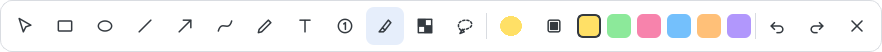
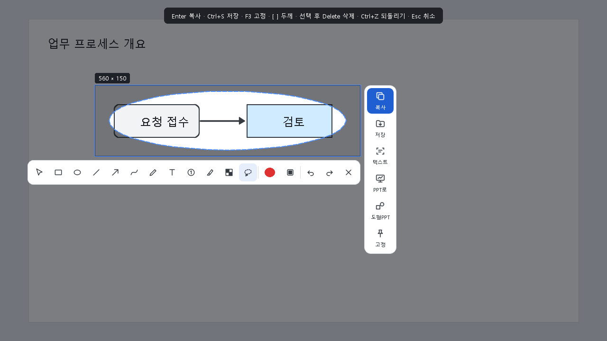
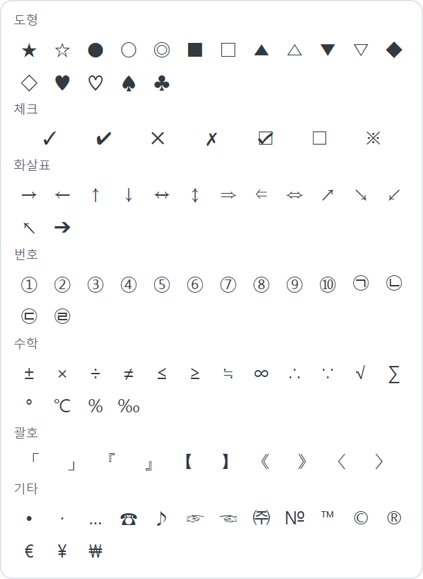
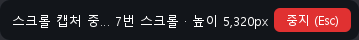
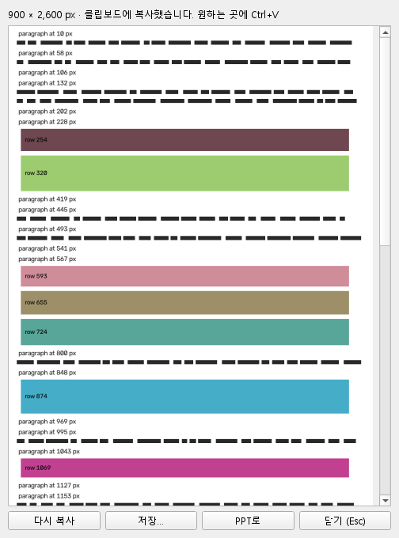
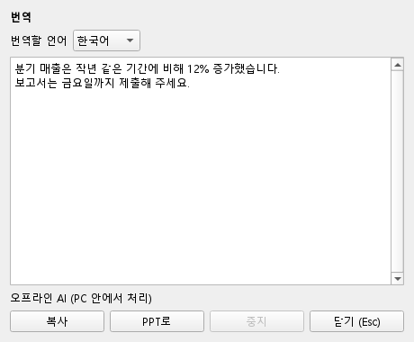
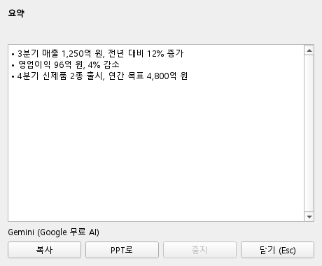
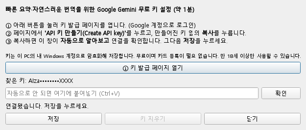
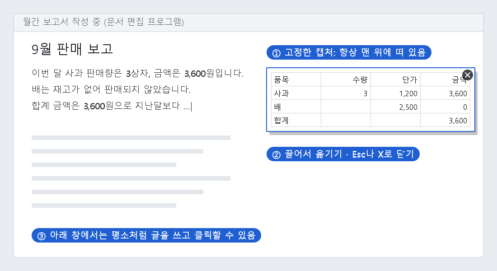

# 캡처 도구 사용 가이드 (처음 쓰는 분용)

이 문서는 컴퓨터에 익숙하지 않은 분도 따라 할 수 있도록 **다운로드 → 설치 → 사용 → 문제 해결 → 제거** 순서로 한 단계씩 설명합니다.
천천히 순서대로 따라 하시면 됩니다.

---

## 목차

1. [이 프로그램으로 할 수 있는 일](#1-이-프로그램으로-할-수-있는-일)
2. [준비물 확인](#2-준비물-확인)
3. [다운로드하기](#3-다운로드하기)
4. [설치하기](#4-설치하기)
5. [처음 실행 확인하기](#5-처음-실행-확인하기)
6. [기본 사용법: 캡처하고 붙여넣기](#6-기본-사용법-캡처하고-붙여넣기)
7. [그림 그리기 (빨간 상자, 화살표, 번호 등)](#7-그림-그리기)
8. [오른쪽 아이콘 5개 사용법](#8-오른쪽-아이콘-5개-사용법)
9. [단축키 바꾸기와 설정](#9-단축키-바꾸기와-설정)
10. [단축키 한눈에 보기](#10-단축키-한눈에-보기)
11. [문제가 생겼을 때](#11-문제가-생겼을-때)
12. [프로그램 지우기](#12-프로그램-지우기)

---

## 1. 이 프로그램으로 할 수 있는 일

- **Alt + ~** 키 한 번으로 화면을 캡처합니다.
- 캡처한 그림 위에 **빨간 상자, 동그라미, 화살표, 번호, 글자**를 바로 그립니다.
- 캡처한 그림을 **카카오톡, 메일, 한글, 워드, 파워포인트** 등 어디든 붙여넣습니다.
- 그림 속 **글자를 인식해서 복사**합니다. 인터넷이 없어도 됩니다.
  - 인식 언어: **한국어, 영어**, 그리고 **프랑스어·스페인어·독일어·이탈리아어·포르투갈어** 등 라틴 문자를 쓰는 언어(é, ç, ñ, ß, ¿ 같은 글자 포함). 언어를 고를 필요 없이 자동으로 알아봅니다.
  - 중국어, 일본어, 러시아어 등은 아직 지원하지 않습니다.
- 그림 속 **도형(네모, 동그라미, 화살표)을 파워포인트에서 고칠 수 있는 도형**으로 바꿔 넣습니다.
- 캡처한 그림을 **화면 위에 붙여 두고** 보면서 작업합니다.

모든 처리는 내 컴퓨터 안에서만 이루어집니다. 캡처한 그림이나 글자가 인터넷으로 전송되지 않습니다.

---

## 2. 준비물 확인

| 항목 | 필요 조건 |
|---|---|
| 운영체제 | Windows 10 또는 Windows 11 (64비트) |
| 저장 공간 | 약 350MB |
| 관리자 권한 | **필요 없음** (회사 PC에서도 설치 가능) |
| 따로 설치할 것 | **없음** (필요한 것이 모두 포함되어 있음) |
| 파워포인트 | "PPT로" 기능을 쓸 때만 필요 (Microsoft 365 권장) |

> **내 Windows 버전 확인 방법**: 키보드에서 `Windows 키 + R` → `winver` 입력 → Enter.
> "Windows 10" 또는 "Windows 11"이라고 나오면 됩니다.

---

## 3. 다운로드하기

1. 전달받은 GitHub 주소를 인터넷 브라우저(크롬, 엣지 등)로 엽니다.
   > 이 저장소는 **비공개**입니다. 관리자에게 초대받은 GitHub 계정으로 **로그인한 상태**여야 보입니다.
   > "404 페이지를 찾을 수 없음"이 뜨면 로그인이 안 됐거나 초대를 아직 수락하지 않은 것입니다. 메일함에서 GitHub 초대 메일을 확인하세요.
2. 화면 오른쪽의 **Releases**(릴리스)를 누릅니다.
3. 가장 위(최신 버전)에 있는 **Assets** 아래에서 `CaptureTool-Setup-버전.exe` 파일을 누릅니다.
4. 브라우저 아래쪽이나 오른쪽 위에 다운로드가 표시됩니다. 끝날 때까지 기다립니다(약 100MB).

> **"일반적으로 다운로드되지 않는 파일입니다"라는 경고가 뜨면** (엣지 브라우저)
> 파일 옆의 `…` → **유지** → **자세히 표시** → **그래도 계속**을 누릅니다.
> 새로 만든 프로그램이라 다운로드 수가 적어서 뜨는 안내이며, 파일에는 문제가 없습니다.

---

## 4. 설치하기

1. 다운로드한 `CaptureTool-Setup-버전.exe`를 **두 번 클릭**합니다.
2. **"Windows의 PC 보호"라는 파란 창이 뜨면**
   - **추가 정보**(작은 글씨)를 누릅니다.
   - 아래에 생기는 **실행** 버튼을 누릅니다.
   > 개인이 만든 무료 프로그램이라 아직 "디지털 서명"이 없어서 뜨는 안내입니다.
3. 설치 언어를 **한국어**로 두고 **확인**을 누릅니다.
4. 사용권 계약(MIT, 무료 사용 허가)을 읽고 **동의합니다** → **다음**을 누릅니다.
5. 추가 작업 선택 화면:
   - ✅ **Windows 시작 시 자동 실행**: 켜 두기를 권장합니다. 켜 두면 컴퓨터를 켤 때마다 단축키를 바로 쓸 수 있습니다.
   - ☐ **바탕 화면에 바로가기 만들기**: 원하면 선택합니다.
6. **설치**를 누르고, 끝나면 **"캡처 도구 실행"**에 체크된 상태로 **마침**을 누릅니다.

설치 위치는 `C:\Users\(내 이름)\AppData\Local\Programs\CaptureTool` 입니다. 따로 신경 쓰지 않아도 됩니다.

---

## 5. 처음 실행 확인하기

이 프로그램은 창이 따로 뜨지 않고, **화면 오른쪽 아래 작업 표시줄(시계 옆)에 아이콘으로 숨어서** 기다립니다.

1. 시계 왼쪽의 **∧ (위쪽 화살표)**를 누릅니다.
2. **파란 네모 안에 흰 모서리 모양** 아이콘이 보이면 실행 중입니다.
3. 처음 실행하면 "실행 중입니다. Alt + ~ 로 캡처하세요."라는 알림이 한 번 뜹니다.

> **아이콘을 항상 보이게 하려면**: ∧를 눌러 나온 아이콘을 작업 표시줄의 시계 옆으로 **끌어다 놓으세요**.

> **실행이 안 되어 있으면**: `Windows 키` → **캡처 도구** 입력 → 눌러서 실행합니다.

---

## 6. 기본 사용법: 캡처하고 붙여넣기

### 6-1. 캡처하기

1. 캡처하고 싶은 화면을 띄워 둡니다.
2. 키보드 왼쪽 아래의 **Alt 키를 누른 채로**, 숫자 1 왼쪽에 있는 **~ 키**를 누릅니다.
   - Mac 키보드를 쓰시면 **Option + ~** 입니다(같은 키입니다).
3. 화면이 **멈추고 살짝 어두워집니다**. 마우스가 있는 모니터가 먼저 멈춥니다.

4. 원하는 부분의 **왼쪽 위에서 마우스 왼쪽 버튼을 누른 채 오른쪽 아래로 끌었다가** 놓습니다.
   - **창 하나를 통째로** 잡고 싶으면, 끌지 말고 그 창 위에서 **한 번 클릭**하면 됩니다.
   - 마우스 옆의 작은 확대경은 커서 아래를 크게 보여 줍니다. 정확한 위치를 잡을 때 쓰세요.
   - 취소하려면 **Esc** 키를 누릅니다.

### 6-2. 붙여넣기

1. 영역을 고르면 **그 순간 클립보드에 복사**됩니다. 아래에 **그리기 도구**, 오른쪽에 **아이콘**이 나타납니다.
2. 바로 붙여넣을 곳(카카오톡 대화창, 메일 본문, 파워포인트 등)을 열고 **Ctrl + V** 를 누르면 됩니다.
   **Ctrl + C**(또는 **Enter**, 파란 **복사** 아이콘)를 눌러도 똑같이 복사되고 캡처 화면이 닫힙니다.
3. 그림을 그리면(상자·화살표·글자 등) 클립보드의 복사본도 **그린 그대로 바뀝니다**.

> 영역을 고르자마자 복사되는 게 싫으면 **설정 → 영역을 고르면 바로 클립보드에 복사**를 끄세요.

> 잘못 골랐다면? 영역을 고른 뒤에도 **방향키**로 1칸씩 옮길 수 있습니다(Shift+방향키는 10칸).

---

### 6-3. 창 하나를 통째로 찍기 (제목줄 클릭)

캡처를 시작한 뒤 **드래그하지 말고, 찍고 싶은 창의 제목줄(또는 창 위 아무 곳)을 한 번 클릭**하세요. 그 창 전체가 선택됩니다.

- 마우스를 창 위에 올리면 파란 테두리와 함께 **"창 이름 · 클릭하면 창 전체 선택"** 이 보입니다.
- 창이 **두 모니터에 걸쳐 있거나 화면 밖으로 일부 나가 있어도** 괜찮습니다. 안내가 **"클릭하면 창 전체 (다른 모니터·화면 밖에 걸친 부분까지 한 장으로)"** 로 바뀌고, 클릭하면 창 전체가 한 장으로 찍힙니다. 다른 창에 가려진 부분도 창 내용 그대로 나옵니다.
  - 이때는 바로 **클립보드에 복사**되고, 스크롤 캡처와 같은 **캡처 편집 창**이 열려 그리기·텍스트·PPT로·도형PPT·링크·고정을 모두 쓸 수 있습니다.
- 창이 한 모니터 안에 있으면 평소처럼 그 영역에 그림을 그릴 수 있습니다.
- 처음 세 번은 캡처 화면 위쪽에 이 기능을 알려 주는 **파란 팁**이 보입니다.

### 6-4. 자동 저장 — 캡처할 때마다 파일로

미리 켜 두면 **캡처를 끝낼 때마다 저장 폴더에 자동으로 저장**됩니다. 복사(Enter), PPT로, 고정, 텍스트, 번역·요약, 창 전체 캡처, 스크롤 캡처 — 무엇을 하든 저장됩니다.

- **켜는 법 (둘 중 하나)**
  - 작업 표시줄 오른쪽 트레이의 캡처 도구 아이콘 → **캡처 자동 저장** 체크
  - **설정** → "캡처하면 자동으로 저장 폴더에 저장" 체크
- 저장 위치는 설정의 **저장 폴더**(기본: `사진\Captures`), 파일 이름은 `Capture_날짜_시간.png`입니다. 그린 내용도 함께 저장됩니다.
- 영역만 고르고 **아무것도 하지 않은 채 Esc로 닫으면 저장하지 않습니다** (실수로 찍은 것까지 쌓이지 않게).
- 저장하면 화면 아래에 "저장했습니다: 경로"가 잠깐 보입니다.

### 6-5. 링크로 보내기

오른쪽 아이콘의 **링크**를 누르면 두 가지 중 고를 수 있습니다.

| 메뉴 | 무엇이 복사되나요 | 누가 열 수 있나요 |
|---|---|---|
| **파일 링크 복사** | 저장된 파일의 위치 (예: `D:\캡처\Capture_….png`). 아직 저장 전이면 먼저 저장합니다. 인터넷에 올리지 **않습니다**. | 같은 PC, 또는 그 폴더에 들어갈 수 있는 사람 (공유 폴더 `\\서버\폴더`나 OneDrive 동기화 폴더를 저장 폴더로 쓰면 동료도 열 수 있음) |
| **인터넷 공유 링크 만들기** | `https://litter.catbox.moe/…` 같은 인터넷 주소 | **링크를 아는 누구나** — 메신저·메일에 붙여 넣으면 바로 열림 |

- 인터넷 공유 링크는 캡처를 무료 임시 보관 서비스(Litterbox)에 올려 만듭니다. **정해진 시간(기본 24시간) 뒤 자동으로 삭제**되고, 그 전에는 지울 수 없습니다. 보관 시간은 설정에서 1시간·12시간·24시간·3일 중 고릅니다.
- 처음 한 번 "인터넷에 올라갑니다" 확인을 받습니다. **회사 기밀·개인정보가 보이는 캡처는 올리지 마세요** (모자이크 도구로 가린 뒤 올리세요).
- 캡처 편집 창(스크롤 캡처·창 전체 캡처)에서도 오른쪽 **링크** 아이콘을 똑같이 쓸 수 있습니다.

---

## 7. 그림 그리기

영역을 고르면 아래에 도구 막대가 뜹니다. 도구를 누르고 그림 위에서 **마우스로 끌면** 그려집니다.

| 도구 | 하는 일 | 바로 가는 키 |
|---|---|---|
| ↖ 선택 | 그린 것을 끌어서 옮김 | V |
| □ 사각형 | 강조 상자 (예: 빨간 상자) | R |
| ○ 타원 | 동그라미 | O |
| ╱ 직선 | 직선 | L |
| ↗ 화살표 | 가리키는 화살표 | A |
| ∿ 곡선 | 부드러운 곡선 | C |
| ✎ 펜 | 자유롭게 그리기 | P |
| T 텍스트 | 클릭한 자리에 글자 입력 → Enter | T |
| ① 번호 | 클릭할 때마다 ①②③ 자동 증가 | N |
| 형광펜 | 반투명 강조 (노랑·연두·분홍·하늘·주황·보라) | H |
| 모자이크 | 개인정보 등을 흐리게 가림 | M |
| 자유형 자르기 | 남길 부분을 따라 그리면 **그 모양대로** 잘림 | K |

- **색과 두께 바꾸기**: 도구 막대의 **동그란 색 버튼**을 누르면 팔레트가 열립니다.
  - 색: 16가지 기본 색, 최근에 쓴 색, **사용자 지정 색…**
  - 두께: 슬라이더를 끌거나 숫자를 직접 입력해서 **1~60px 사이 원하는 굵기**로 정합니다. 자주 쓰는 굵기(1·2·4·6·10·20)는 **빠른 선택** 버튼으로 바로 고릅니다.
  - 키보드로도 됩니다: `]` 한 단계 굵게, `[` 한 단계 얇게 (Shift를 같이 누르면 5씩)
  - 투명도: 슬라이더로 조절

  

- **이미 그린 도형 고치기**: **↖ 선택** 도구로 도형을 한 번 클릭하면 점선 테두리가 생깁니다. 이 상태에서 색·두께·채우기·글자 서식을 바꾸면 **그 도형에 바로 적용**됩니다. `Delete` 키로 지울 수 있고, `Ctrl + Z`로 되돌릴 수 있습니다.
- **속을 채운 도형**: ▣ 버튼을 켜면 사각형과 타원 안이 색으로 채워집니다.
- **형광펜 색**: 형광펜을 고르면 도구 막대에 **형광 6색**(노랑·연두·분홍·하늘·주황·보라)이 나타납니다. 눌러서 바로 바꾸세요. 형광펜 색은 펜 색과 **따로 기억**하므로, 빨간 펜을 쓰다가 형광펜으로 바꿔도 빨간 형광펜이 되지 않습니다. 동그란 색 버튼의 팔레트로 다른 색을 골라도 됩니다.

  

### 자유형 자르기 — 원하는 모양대로 자르기

네모가 아닌 모양(사람, 물건, 말풍선 등)만 떼어 내고 싶을 때 씁니다.

1. 영역을 고른 뒤 도구 막대에서 **자유형 자르기**(점선 올가미 아이콘)를 누르거나 **K**를 누릅니다.
2. 남길 부분의 **테두리를 따라 마우스로 한 바퀴** 그립니다. 끝점은 시작점 근처에서 떼면 자동으로 이어집니다.
3. 잘려 나갈 바깥은 어둡게, 남는 부분은 점선으로 보입니다. 다시 그리면 **새 모양으로 바뀌고**, `Ctrl + Z`로 되돌릴 수 있습니다.
4. 복사·저장·PPT로·고정을 하면 **그린 모양대로 잘린 그림**이 나옵니다. 크기도 그 모양에 딱 맞춰집니다.

- 바깥 부분은 **투명**합니다. PNG로 저장하거나 파워포인트·워드에 붙이면 배경 없이 들어갑니다.
- JPG로 저장하거나 투명을 지원하지 않는 프로그램에 붙이면 바깥이 **흰색**으로 보입니다.
- 너무 작게 그리면 "자를 모양이 너무 작습니다"라고 알려 주고 무시합니다.
- 텍스트·도형 인식도 잘라 낸 **안쪽만** 봅니다.

### 글자 넣기와 서식

**T 텍스트** 도구를 누르면 도구 막대에 **글자 크기와 서식 버튼**이 나타납니다.

1. 그림 위 원하는 자리를 클릭하고 글자를 입력합니다.
2. 입력하는 중에도 아래 단축키로 모양을 바꿀 수 있습니다. 입력칸에 바로 미리 보입니다.
3. **Enter**를 누르면 글자가 들어갑니다. **Esc**를 누르면 입력만 취소되고 캡처는 그대로 남습니다.
4. 입력칸 밖을 클릭해도 입력이 끝납니다. 아무것도 안 썼으면 입력칸이 그냥 사라지고, 썼으면 글자가 들어갑니다. 새 글자를 넣으려면 원하는 곳을 한 번 더 클릭하세요.

| 서식 | 단축키 | 버튼 |
|---|---|---|
| **글씨체** | — | 글씨체 상자에서 고르기 (이름을 입력하면 바로 찾아감) |
| 굵게 | `Ctrl + B` | **B** |
| 기울임 | `Ctrl + I` | *I* |
| 밑줄 | `Ctrl + U` | U |
| 취소선 | `Ctrl + 5` (엑셀과 같은 키) | S |
| 글자 크게 / 작게 | `Ctrl + ]` / `Ctrl + [` | 크기 칸에 숫자 입력 (8~144px) |
| **배경색** | — | **배경** 버튼 → 색 고르기 ("배경 없음"으로 끄기) |
| **기호** | — | **※** 버튼 → ★ ✓ → ① ※ ℃ 【】 등 고르기 |

이미 넣은 글자도 **↖ 선택**으로 클릭한 뒤 같은 단축키나 버튼으로 바꿀 수 있습니다. 글자 서식은 "PPT로"로 보낼 때도 그대로 유지됩니다.

**글자 배경색**
- **배경** 버튼을 누르고 색을 고르면 글자 뒤에 둥근 색 상자가 깔립니다. 연한 색(노랑·연두·하늘·분홍·회색)이 맨 앞에 있어 검은 글자와 잘 어울립니다.
- 글자를 입력하는 중에 바꾸면 입력칸에 바로 미리 보입니다. 이미 넣은 글자는 **↖ 선택**으로 클릭한 뒤 바꾸면 됩니다 (`Ctrl + Z`로 되돌리기).
- 글자색과 배경색이 같으면 글자가 안 보이니 다른 색을 고르세요. 마지막에 쓴 배경색은 다음 캡처에서도 그대로 씁니다.

**기호 넣기**
- **※** 버튼을 누르면 기호 목록(도형·체크·화살표·번호·수학·괄호·기타)이 열립니다. 누른 기호가 바로 들어갑니다.
  - 글자를 입력하는 중이면 **커서 자리**에 들어갑니다.
  - **↖ 선택**으로 글자를 골라 둔 상태면 그 글자 **끝에** 붙습니다.
  - 아무것도 없으면 **다음에 클릭한 자리**에 기호가 든 입력칸이 열립니다.
- 컬러 이모지(😀)는 저장한 그림이나 파워포인트에서 네모로 깨질 수 있어 목록에 넣지 않았습니다.

**글씨체 고르기**
- 글씨체 상자를 누르면 **맨 위에 자주 쓰는 한글 글꼴**(맑은 고딕, 나눔고딕, 나눔명조, 본고딕, 굴림, 돋움, 바탕, 궁서, 함초롬 등 — **내 PC에 설치된 것만**)이 각자의 모양으로 보이고, 구분선 아래에 **나머지 모든 글꼴**이 가나다·ABC 순으로 나옵니다.
- 상자에 "궁서", "arial"처럼 이름 일부를 입력하면 맞는 글꼴을 찾아 줍니다.
- 마지막에 쓴 글씨체는 **기억해 두었다가** 다음 캡처에서 그대로 사용합니다.
- 영문 전용 글꼴(Arial 등)을 고르면 한글 부분은 Windows가 비슷한 한글 글꼴로 대신 보여 줍니다.
- 캡처 이미지(복사·저장)에는 고른 글씨체 그대로 들어갑니다. "PPT로"로 보낸 글자는 **받는 PC에 그 글꼴이 없으면** PowerPoint가 비슷한 글꼴로 바꿔 보여 줍니다. 여러 사람과 공유할 문서라면 맑은 고딕·굴림·바탕처럼 Windows 기본 글꼴을 권장합니다.
- **되돌리기 / 다시 하기**: `Ctrl + Z` / `Ctrl + Y` (또는 막대의 ↶ ↷)
- **그만두기**: ✕ 버튼 또는 **Esc**

---

## 8. 캡처 아래 버튼 막대 사용법

v0.7부터 버튼들이 캡처 **바로 아래 한 줄**로 나옵니다(아래에 자리가 없으면 위, 그래도 없으면 캡처 안쪽 아래).

- 기본 줄: **복사 · 자동저장 · 텍스트 · 표 · PPT · 메일 · 카톡 · 검색 · 고정 · 전체**
- **전체**를 누르면 둘째 줄(다른 이름 저장 · 도형PPT · 스크롤 · 링크 · 저장 폴더)이 펼쳐지고, 다시 누르면(**기본**) 접힙니다. 마지막 상태를 기억합니다.
- **자동저장**: 눌린(파란 테두리, "자동저장 켜짐") 상태면 캡처를 끝낼 때마다 저장 폴더에 파일로도 저장됩니다. 누를 때마다 켜고 끕니다.

### 메일 — 네이버·Gmail 등으로 보내기

1. 캡처하고 **메일**을 누릅니다. 캡처는 이미 복사되어 있습니다.
2. 받는 사람을 고릅니다: **자주 / 최근 / 그룹 / 전체 주소록** 탭에서 체크하고, 사람마다 **받는 사람 / 참조**를 고릅니다. 새 주소는 위 칸에 입력하고 Enter(예: `홍길동 <hong@회사.com>`).
3. **보낼 메일**(네이버 메일 · Gmail · 네이버웍스 · 다음 · Outlook · PC 기본 메일 앱 · 직접 입력)을 고르고 **메일 쓰기**.
4. 브라우저에서 메일 쓰기 화면이 열리고, 화면 오른쪽에 **메일 붙여넣기 도우미**가 뜹니다. 쓰기 화면의 칸을 누르고 도우미의 버튼 → **Ctrl+V** 를 차례로: ① 받는 사람 ② 참조 ③ 제목 ④ 캡처(본문).
   - **Gmail**은 받는 사람·참조·제목이 이미 채워져 열립니다(④만 하면 됨).
   - 로그인 화면이 나오면 로그인한 뒤 도우미로 이어서 하세요.
   - 회사 보안 때문에 붙여넣기가 막히면 **캡처를 파일로 저장(첨부용)** 을 눌러 첨부하세요.
5. **[보내기]는 직접** 누릅니다. 캡처 도구는 메일을 보내지 않고, 비밀번호나 로그인 정보도 다루지 않습니다.

**주소록**: [주소·그룹 편집]에서 추가·삭제, 그룹 만들기, **CSV 가져오기**(Gmail·네이버 주소록에서 내보낸 파일, 엑셀 파일 모두) / 내보내기. 주소록은 **이 PC의 이 Windows 사용자만** 열 수 있게 암호화해 저장하고, 인터넷에 올리지 않습니다. 회사 메일 쓰기 주소나 Gmail 계정(여러 개일 때)은 **설정 → 메일**에서 정합니다.

### 표 — 표 모양이 아닐 때는 미리보기

캡처한 글이 표 모양이 아니면(예: "• 일시: …" 목록) **표로 붙여넣기 미리보기**가 먼저 뜹니다.
- 칸 나누는 기준: 자동 / "항목: 값" 두 칸 / 띄어쓰기 2칸 이상·탭 / 쉼표 / 한 줄 = 한 칸 / 직접 입력(예: `/`)
- 첫 줄을 제목으로, 글머리표(•) 빼기, 머리글 행 추가를 고를 수 있고, 칸을 눌러 바로 고치거나 줄·칸을 더하고 뺄 수 있습니다.
- **표로 복사**(엑셀·파워포인트에 Ctrl+V) 또는 **PPT 표로 넣기**.

### 검색 — 구글·네이버

- **그림으로 찾기**(구글 / 네이버): 이미지 검색 화면을 열어 줍니다. 캡처는 복사되어 있으니 검색창을 누르고 **Ctrl+V**(또는 카메라 아이콘 → 이미지 붙여넣기). 붙여 넣기 전에는 아무것도 올라가지 않습니다.
- **글자로 찾기**(구글 검색 / 네이버 검색 / 파파고 번역): 캡처 속 글자를 읽어 바로 검색합니다.

### 고정 — 여러 장을 화면에 띄우기

- **고정** 버튼 → 띄울 곳: **찍은 자리에 그대로(F3)** / **화면 오른쪽 위에 쌓기** / **다른 모니터로**. 여러 장을 계속 띄울 수 있습니다.
- 고정한 캡처에 마우스를 올리면 작은 막대: **50%**(반투명) · **+ / −**(크기) · **복사** · **✕**.
- **고정한 캡처 관리**(고정 버튼 메뉴, 트레이 메뉴, 고정 캡처 우클릭): 누르면 그 캡처를 앞으로, **오른쪽에 나란히**, **모두 숨기기/보이기**, **모두 반투명/또렷**, **모두 닫기**(한 번 묻습니다).

## 8-1. 버튼별 설명 (예전 오른쪽 아이콘)

영역을 고르면 그림 **오른쪽**(자리가 없으면 왼쪽)에 아이콘이 세로로 나타납니다: 복사 · 저장 · 텍스트 · PPT로 · 도형PPT · 스크롤 · **링크** · 고정. (화면이 작으면 두 줄로 나옵니다.)

### ① 복사 (파란 아이콘)
그린 내용까지 포함해서 복사합니다. 원하는 곳에서 **Ctrl + V** 하면 됩니다. Enter 키와 같습니다.

### ② 저장 — 원하는 폴더에 파일로 저장
1. **저장** 아이콘을 누릅니다.
2. "저장할 위치 선택" 창에서 **폴더를 고르고, 파일 이름을 확인**한 뒤 **저장**을 누릅니다.
   - 파일 이름은 `Capture_날짜_시간.png`로 미리 채워져 있습니다.
   - 다음 번에는 **마지막으로 저장한 폴더**에서 창이 열립니다.
3. 저장 창에서 **취소**를 누르면 캡처와 그린 그림이 **그대로 남아 있으니** 안심하세요.

> 매번 고르기 번거롭다면 **Ctrl + S** 를 누르세요. 설정해 둔 폴더(기본: `사진\Captures`)에 바로 저장됩니다.

### ③ 텍스트 — 그림 속 글자를 복사
1. **텍스트** 아이콘을 누릅니다.
2. 1초 정도 뒤 **글자 전체가 자동으로 복사**되고, 캡처 화면이 **텍스트 모드**로 바뀝니다. 인식된 글자에 파란 표시가 생깁니다.
3. **원하는 부분만 복사하려면**: 그 글자 위를 **마우스로 드래그**하세요. 드래그한 부분의 글자만 바로 복사됩니다. 몇 번이든 다시 드래그할 수 있습니다.

텍스트 모드 아래쪽 막대의 버튼:
- **전체 복사 (Enter)**: 인식한 글자 전부 다시 복사
- **창으로 보기**: 별도 창에서 글자를 보며 원하는 줄을 골라 복사. 창은 **Esc** 또는 **닫기 (Esc)** 버튼으로 닫습니다.
- **그리기로 돌아가기 (Esc)**: 텍스트 모드를 끝내고 그림 그리기로 돌아감 (캡처는 그대로)

**엑셀 표를 캡처했다면**: 엑셀·구글 시트처럼 **칸 선이 있는 표**는 자동으로 알아봐서 **표 모양 그대로** 복사합니다. 엑셀에 붙여넣으면 칸이 그대로 나뉘어 들어가고, 빈 칸도 빈 칸으로 유지됩니다. 알림에 "표 4행×4열로 복사했습니다"처럼 표시됩니다. 칸 선이 없는 표는 텍스트 창의 **표로 복사 (Excel)** 버튼을 쓰세요.

- 머리글 행에 **색을 채운 표**, **격자선을 끈 표**, 엑셀의 **A B C / 1 2 3 머리글까지 함께 찍은 경우**도 표 칸만 골라 냅니다.
- 붙여넣을 때 숫자는 숫자로 들어가고, `007` 같은 코드는 앞의 0이 유지됩니다. 화면에 `=SUM(...)`처럼 보이는 글자는 **수식으로 실행되지 않고 글자 그대로** 들어갑니다.

- **개인정보 자동 가림**: 전화번호, 이메일, 주민등록번호, 카드번호를 `****`로 가립니다. 설정이나 텍스트 창에서 끌 수 있습니다.
- 그림에 QR 코드가 있으면 텍스트 창에 그 주소도 함께 보여 줍니다.

### ④ PPT로 / 도형PPT — 파워포인트에 바로 넣기

파워포인트로 보내는 아이콘은 두 가지입니다. 파워포인트가 꺼져 있으면 **자동으로 열고**, 켜져 있으면 **지금 보고 있는 슬라이드 바로 뒤에 새 빈 슬라이드**를 만들어 그 가운데에 넣습니다. 기존 슬라이드의 그림 위에 겹치지 않고, 파워포인트 화면도 새 슬라이드로 넘어갑니다.

- 파워포인트에 열린 문서가 없으면 새 문서를 만들어 첫 슬라이드에 넣습니다 (빈 슬라이드가 하나 더 생기지 않습니다).
- 예전처럼 **보고 있는 슬라이드에 넣고 싶으면** 설정에서 "PPT로 보낼 때 새 슬라이드에 넣기"를 끄세요.

| 아이콘 | 무엇이 들어가나요 | 이럴 때 |
|---|---|---|
| **PPT로** | **캡처한 그대로.** 보통은 그린 상자·화살표까지 포함한 **그림**, 텍스트 모드에서는 복사한 **글자**(고칠 수 있는 텍스트 상자) | 화면을 그대로 보고서에 넣고 싶을 때, 인식한 글자를 슬라이드에 넣을 때 |
| **도형PPT** | 그림 속 네모·동그라미·세모·선·화살표를 알아봐서 **파워포인트에서 고칠 수 있는 도형**으로 | 순서도·도식을 다시 그리지 않고 고쳐 쓰고 싶을 때 |

> **넣고 나면 PowerPoint가 화면 맨 앞에 활성화되어 나타나고**, 방금 넣은 그림·글자·도형이 **선택된 상태**로 보입니다. 바로 확인하거나 위치·크기를 고칠 수 있습니다. (PowerPoint가 최소화되어 있어도 다시 띄웁니다.)

**PPT로 — 그림 그대로**
1. 원하는 부분을 캡처하고, 필요하면 그림을 그립니다.
2. **PPT로**를 누르면 그 그림이 **화면에서 보이던 크기 그대로** 슬라이드에 들어갑니다. 슬라이드보다 크면 슬라이드에 맞게 줄어듭니다.
3. 같은 그림이 클립보드에도 들어 있어서 다른 곳에 **Ctrl + V**로도 붙일 수 있습니다.

**PPT로 — 텍스트 모드의 글자**
1. **텍스트** 아이콘으로 글자를 인식합니다. 전체가 복사되고, 드래그하면 일부만 복사됩니다.
2. 이 상태에서 **PPT로**를 누르면 **마지막으로 복사한 글자**가 편집할 수 있는 텍스트 상자로 들어갑니다(드래그로 일부를 복사했다면 그 부분만).
3. 클립보드의 글자는 그대로 남아 있으므로 다른 곳에 **Ctrl + V** 하면 같은 글자가 붙습니다.

**도형PPT — 고칠 수 있는 도형으로**
- 도형 안의 **글자까지 인식해서 도형 안에** 넣고, 화살표는 도형에 **연결된 상태**로 들어갑니다(도형을 옮기면 화살표도 따라옴).
- 그림 위에 **직접 그린 상자·화살표·글자**도 도형으로 들어갑니다.
- 도형의 **채우기 색·테두리 색·테두리 두께**, 글자의 **색·크기·굵게**를 화면에서 읽어 그대로 넣습니다. 도형은 **하나씩 따로** 들어가므로 크기를 바꾸거나 옮기거나 색을 고칠 수 있습니다.
- 인식하는 모양: 사각형, 둥근 사각형, 원·타원, 삼각형, **마름모**, 선, 화살표. 도형 밖의 제목·설명 글자는 **글상자**로 들어갑니다.
- 그라데이션·그림자·점선, 위 목록에 없는 모양은 가장 비슷한 모양(또는 단색)으로 들어갑니다.
- 알아볼 도형이 없으면 그림으로 넣고 알려 줍니다.
- 캡처한 것이 **표**(밝은 화면·어두운 화면, 칸 선이 없는 표도)면 PowerPoint **진짜 표**로 넣습니다. 표 위의 제목 글자는 표 위 글상자로 들어갑니다.
- **색·글꼴 모양 그대로 / 기본 모양** 고르기: 설정의 **PPT·도형·표로 보낼 때 색·글꼴 모양 그대로**를 켜면(기본) 캡처의 색(어두운 표는 어두운 칸, 밝은 글자)이 그대로, 끄면 PowerPoint 기본 모양(흰 바탕·검은 글자, 표는 기본 표 디자인)으로 들어갑니다.
- 어두운 화면의 밝은 글자는 원래 배경색과 함께 넣어 흰 슬라이드에서도 보입니다.

> **파워포인트가 응답하지 않을 때**: 캡처 도구는 최대 15초까지만 기다리고, 그 뒤에는 "응답하지 않습니다"라고 알려 줍니다. 캡처 도구는 멈추지 않으며, 캡처 내용은 클립보드에 있으니 파워포인트가 돌아오면 **Ctrl + V** 하세요.
> 보내는 중에 다시 누르면 중복으로 보내지 않고 알려 줍니다.
> 파워포인트가 없는 컴퓨터에서는 클립보드에만 넣고 알려 줍니다.

### ⑤ 스크롤 — 긴 화면을 한 장으로

화면에 다 안 보이는 긴 웹페이지·문서·채팅을 **자동으로 스크롤하면서** 한 장의 긴 그림으로 이어 붙입니다.

**방법 1. 일반 스크롤 캡처 (고른 영역)**
1. Alt + ~ 로 캡처를 시작하고, 스크롤할 부분(예: 웹페이지 본문, 엑셀 표, 채팅 목록)을 드래그해 고릅니다.
2. 오른쪽 아이콘의 **스크롤**을 누릅니다.
3. 캡처 도구가 **지금 보이는 위치부터 아래로** 자동 스크롤하며 찍습니다. 영역 옆에 진행 상황이 보입니다.

   

4. 끝까지 내려가면 저절로 멈추고, 긴 그림이 **클립보드에 복사**되며 결과 창이 뜹니다.

**방법 2. 브라우저 페이지 전체 (자동)**
1. Alt + ~ 로 캡처를 시작한 뒤, 영역을 드래그하지 말고 **브라우저 창을 한 번 클릭**해 창 전체를 고릅니다.
2. **스크롤**을 누르면 페이지 **맨 위로 올라간 뒤 맨 아래까지** 자동으로 찍습니다.
3. 결과에는 **페이지 내용만** 들어갑니다 (탭·주소창 제외, Chrome·Edge·Whale 등). 페이지 위쪽에 붙어 다니는 메뉴(고정 헤더)는 **맨 위에 한 번만** 나옵니다.

**캡처 편집 창**: 스크롤 캡처가 끝나면 긴 그림이 **편집 창**에 크게 열립니다(이미 클립보드에도 복사되어 있어 바로 Ctrl+V 해도 됩니다). 편집 창에서는 **일반 캡처와 똑같이** 쓸 수 있습니다.

- 위쪽 **그리기 도구와 색상 팔레트**: 사각형·화살표·글자·형광펜·모자이크·자유형 자르기 등
- 오른쪽 아이콘: **복사 · 저장 · 텍스트(글자 인식, 번역·요약) · PPT로 · 도형PPT · 링크 · 고정**
- 확대/축소: **Ctrl+마우스 휠**, 또는 위쪽 **축소 - / 확대 + / 100% / 폭 맞춤**. 마우스 휠만 굴리면 위아래로 움직입니다.
- 처음에는 실제 크기(100%)로 열리고, 그림이 창보다 넓으면 창 너비에 맞춰집니다.
- **텍스트**는 긴 그림 전체의 글자를 처음부터 끝까지 인식합니다. 글자 위를 드래그하면 그 부분만 복사됩니다.
- 끝나면 복사·PPT로 등을 누르거나 **Esc**(또는 창 닫기)로 닫습니다. 편집 창이 열려 있는 동안에는 새 캡처를 시작할 수 없으니 먼저 닫아 주세요.
- 너무 긴 그림을 **고정**하면 화면에 들어오도록 작게 붙습니다(휠로 확대).

**알아 두면 좋은 점**
- **멈추기**: 진행 중에 **Esc** 를 누르거나 진행 표시의 **중지**를 누르면 그때까지 찍은 부분만 복사합니다.
- 스크롤하는 동안 **마우스를 움직이지 마세요.** 캡처 도구가 마우스를 그 영역 위에 두고 휠을 굴립니다. 끝나면 마우스는 원래 자리로 돌아갑니다.
- 너무 긴 페이지는 **높이 20,000픽셀**까지만 찍고 알려 줍니다 (PC에 부담을 주지 않기 위해서).
- 스크롤 중에 **다른 창이 영역을 가리면** 거기서 멈추고 알려 줍니다.
- **스크롤되지 않는 경우**: 스크롤할 내용이 없거나, **관리자 권한으로 실행된 프로그램**이거나, 스크롤을 막아 둔 창이면 보이는 부분만 복사하고 알려 줍니다.
- 페이지가 아래로 갈수록 내용을 더 불러오는 사이트(무한 스크롤)는 잠깐 기다렸다가 이어서 찍습니다. 끝이 없는 사이트는 Esc로 멈추세요.
- 쿠키 동의·로그인 **팝업이 페이지를 덮고 있으면** 스크롤이 안 됩니다. 팝업을 먼저 닫아 주세요.
- 가로 스크롤은 지원하지 않습니다. 스크롤을 시작하기 **전에** 그린 내용은 들어가지 않습니다 — 끝난 뒤 열리는 편집 창에서 그리세요.
- 따로 단축키를 정하면(설정 → **스크롤 캡처**) 영역을 고르자마자 스크롤 캡처가 시작됩니다.

### 번역 · 요약 (무료 AI)

**텍스트** 모드에서 인식한 글을 **번역**하거나 **요약**합니다.

1. 캡처하고 **텍스트**를 누릅니다. 글자가 인식되면 아래 막대에 **번역**·**요약** 버튼이 있습니다.
2. 일부만 하고 싶으면 그 글자 위를 먼저 **드래그**하세요. 드래그한 부분만 번역·요약합니다.
3. **번역**을 누르면 결과 창이 뜹니다. 외국어는 한국어로, 한국어는 영어로 자동으로 바뀝니다. 위쪽 목록에서 다른 언어(영어·일본어·중국어·프랑스어·스페인어·독일어)를 고르면 다시 번역합니다.
4. **요약**을 누르면 핵심을 3~5줄로 정리합니다.
5. 결과 창에서 **복사**하거나 **PPT로** 보낼 수 있습니다. **중지**로 멈추고, **Esc**로 닫습니다.
6. 답이 **표 모양**이면(`|`로 나눈 칸, 탭, 칸을 맞춘 글, "항목: 값" 줄) **표로 복사** 버튼이 켜집니다. 엑셀이나 파워포인트에 붙여넣으면 칸이 나뉜 **진짜 표**가 됩니다. 칸이 있는 표는 **PPT로**를 눌러도 파워포인트 **표**로 들어갑니다("항목: 값" 목록은 글상자로).

**무엇으로 번역·요약하나요?**

| | 번역 | 요약 |
|---|---|---|
| 기본 (키 없음) | **오프라인 AI** — 설치하면 바로 됨(한국어↔영어). 다른 언어는 처음 쓸 때 한 번 받음(언어마다 70~290MB) | **오프라인 AI** — 처음 쓸 때 한 번 받음(약 1.4GB), 이후 인터넷 없이 10~30초 |
| Gemini 무료 키를 넣으면 | 설정에서 "번역도 Gemini로"를 켜면 더 자연스러운 번역 | **1~3초**로 빠르고 더 정확한 요약 |

- 오프라인 AI는 글이 **PC 밖으로 나가지 않습니다**. 회사 문서에 안심하고 쓰세요. 처리하는 동안 PC가 조금 무거워질 수 있어, CPU를 전부 쓰지 않도록 제한해 두었고 90초 동안 안 쓰면 메모리에서 내려갑니다.
- 모델이 필요하면 "받을까요?"라고 먼저 묻고, 받는 동안 결과 창에 진행 상황이 보입니다.

#### Gemini 무료 키 넣기 (선택, 약 1분)

1. 트레이 아이콘 → **설정** → **AI 번역·요약**의 **무료 키 설정 안내…** 를 누릅니다.
2. **① 키 발급 페이지 열기**를 누르면 Google AI Studio가 열립니다. Google 계정으로 로그인합니다.
3. 페이지에서 **API 키 만들기(Create API key)** 를 누르고, 만들어진 키 옆의 **복사**를 누릅니다.
4. 캡처 도구 창이 **복사한 키를 자동으로 알아보고** 연결을 확인합니다. "연결됐습니다"가 보이면 **저장**을 누르세요.
   - 자동으로 안 되면 창의 입력칸에 **Ctrl+V** 로 붙여넣고 **확인**을 누릅니다.

**꼭 알아 두세요 (Gemini)**
- Gemini를 쓰면 글이 **Google 서버로 전송**됩니다. 처음 쓸 때 동의를 묻습니다.
- 무료 등급에서는 Google이 품질 개선을 위해 **사람이 내용을 볼 수 있습니다.** 회사 기밀·개인정보가 담긴 글은 오프라인으로 하세요. 전화번호·이메일·주민번호·카드번호는 보내기 전에 자동으로 가립니다.
- 무료 사용량에 하루 한도가 있습니다. 한도를 넘거나 인터넷이 안 되면 **자동으로 오프라인 AI로** 처리하고 알려 줍니다.
- 키는 이 PC의 내 Windows 계정으로 **암호화**해 저장합니다. 설정 파일을 다른 PC로 옮겨도 키는 풀리지 않습니다. 필요 없으면 키 설정 창의 **키 지우기**를 누르세요.
- Google 약관상 만 18세 이상만 쓸 수 있고, 유럽(EEA)·영국·스위스에서는 무료 등급을 쓸 수 없습니다.

### 카톡 — 카카오톡으로 보내기

1. 캡처하고 오른쪽 **카톡** 아이콘을 누릅니다.
2. 메뉴에 **지금 열려 있는 채팅방**이 보입니다. 채팅방을 고르면 캡처가 복사되고, 그 채팅방이 앞으로 나오며 그림이 붙여 넣어집니다.
3. 카카오톡이 띄우는 확인 창에서 **[전송]**을 누르면 보내집니다. **캡처 도구가 대신 보내지는 않습니다** — 잘못된 방에 보내지는 일이 없도록 마지막은 직접 누릅니다.
4. 원하는 채팅방이 목록에 없으면 **카카오톡 열기**를 고릅니다. 카카오톡이 열리면 채팅방을 열고 **Ctrl + V → [전송]**.

> 카카오톡이 설치되어 있지 않으면 캡처만 복사하고 알려 줍니다. 목록에는 카카오톡에서 따로 띄워 둔 채팅방 창만 나옵니다.

### 표 — 캡처 속 표를 바로 표로 복사

표를 캡처했으면 오른쪽 아이콘의 **표**를 누르세요. 칸을 그대로 나눠 복사합니다. 엑셀이나 파워포인트에 **Ctrl + V** 하면 칸마다 고칠 수 있는 표가 됩니다. 어두운 화면의 표, 칸 선이 없는 표도 됩니다. 표가 없으면 알려 줍니다.

### 텍스트 모드의 표로 복사

캡처한 글자가 표처럼 칸이 맞춰져 있으면(웹 페이지 표, 어두운 화면의 표 등) 텍스트 모드 막대에 **표로 복사** 버튼이 나타납니다. 누르면 칸이 나뉜 표로 복사되어 엑셀·파워포인트에 그대로 붙습니다.

### ⑥ 고정 — 캡처를 화면 위에 붙여 두기

#### 고정이 뭔가요?
캡처한 그림을 **작은 창으로 만들어서, 다른 모든 창보다 항상 위에 떠 있게** 하는 기능입니다.
모니터에 **메모지(포스트잇)를 붙여 두는 것**과 같습니다. 다른 프로그램을 클릭하거나 창을 바꿔도 고정한 그림은 사라지지 않고 계속 보입니다.

위 그림처럼 **아래 창에서는 평소대로 글을 쓰고 클릭하면서**, 고정한 캡처(표)를 계속 보며 작업할 수 있습니다.

#### 이럴 때 쓰세요
| 상황 | 예시 |
|---|---|
| **자료를 보면서 옮겨 적을 때** | 엑셀 표나 웹페이지 내용을 고정해 두고, 보고서·메일에 옮겨 적기 |
| **두 화면을 비교할 때** | 수정 전 화면을 고정해 두고, 수정 후 화면과 나란히 비교하기 |
| **창을 바꾸면 사라지는 정보를 잡아 둘 때** | 인증번호, 오류 메시지, 주문번호, 잠깐 뜨는 알림을 붙잡아 두기 |
| **디자인·배치를 맞출 때** | 참고할 디자인 시안을 고정해 두고 PPT·문서에서 모양 맞추기 |
| **설명을 들으며 따라 할 때** | 화상회의나 강의 화면의 설명 부분을 고정해 두고 내 화면에서 따라 하기 |

#### 따라 하기
1. **Alt + ~** 를 누르고 붙여 둘 부분을 드래그해서 고릅니다.
2. (선택) 빨간 상자·화살표 등을 그려 둡니다. 그린 것도 함께 고정됩니다.
3. 오른쪽 아이콘 중 **고정**을 누릅니다. (키보드 **F3**)
4. 캡처한 **그 자리에** 파란 테두리의 그림이 떠 있게 됩니다. 이제 다른 작업을 하세요.

#### 고정한 그림 다루기
| 하고 싶은 것 | 방법 |
|---|---|
| **닫기** | 그림을 한 번 클릭한 뒤 **Esc** · 마우스를 올리면 나타나는 오른쪽 위 **X 버튼** · 그림 **더블클릭** |
| 옮기기 | 그림을 **누른 채 끌기** (다른 모니터로도 옮길 수 있음) |
| 크게 / 작게 | 그림 위에서 **마우스 휠**, 또는 `+` `-` 키 · `0`은 원래 크기 |
| 흐리게 (뒤가 비쳐 보이게) | `Ctrl`을 누른 채 휠 — 아래 창 내용과 겹쳐 보며 맞출 때 편리 |
| 복사 | `Ctrl + C` — 고정한 그림을 다시 붙여넣을 수 있게 복사 |
| 파일로 저장 | `Ctrl + S` — 설정한 저장 폴더에 저장 |
| 메뉴로 하기 | 그림 **우클릭** → 복사 / 저장 / 원래 크기 / 닫기 |
| 여러 개 한 번에 닫기 | 작업 표시줄 캡처 도구 아이콘 **우클릭 → 고정 이미지 모두 닫기** |

#### 알아 두면 좋은 점
- **여러 개를 동시에** 고정할 수 있습니다. 필요한 만큼 캡처해서 여기저기 붙여 두세요.
- 고정한 그림은 **캡처한 순간의 사진**입니다. 원래 화면의 내용이 바뀌어도 고정한 그림은 바뀌지 않습니다. 그래서 뒤쪽 화면이 스크롤되거나 바뀌면 고정 그림과 어긋나 보이는데, 정상입니다.
- 고정한 그림 **위를 클릭하면 그 그림이 잡힙니다**. 아래 창을 클릭하려면 그림을 옆으로 옮기거나 작게 줄이세요.
- 고정한 그림은 작업 표시줄에 따로 나타나지 않습니다. 보이지 않으면 다른 모니터에 있거나 아주 작게 줄였을 수 있으니, 필요하면 **고정 이미지 모두 닫기**로 정리하세요.
- **새로 캡처하면 고정한 그림도 화면의 일부로 함께 찍힙니다.** 찍히지 않게 하려면 먼저 옮기거나 닫으세요.
- 캡처 도구를 **종료하거나 컴퓨터를 끄면 고정한 그림은 사라집니다.** 계속 보관하려면 `Ctrl + S`로 저장해 두세요.

---

## 9. 단축키 바꾸기와 설정

1. 작업 표시줄의 캡처 도구 아이콘을 **마우스 오른쪽 버튼**으로 누릅니다.
2. **설정…**을 누릅니다.

### 단축키 바꾸는 방법
1. 바꾸고 싶은 칸(예: "캡처 + 그리기")을 **한 번 클릭**합니다.
2. 원하는 키 조합을 **실제로 누릅니다**. 예를 들어 Ctrl과 Shift를 누른 채 3을 누르면 `Ctrl + Shift + 3`이 입력됩니다.
3. 칸을 비우려면 칸을 클릭하고 **Backspace**를 누릅니다(그 기능은 단축키 없이 사용).
4. **저장**을 누릅니다.

- 다른 기능과 **같은 키**를 고르거나, Windows가 쓰는 키(예: `Ctrl + C`)를 고르면 칸 아래에 **⚠ 안내 문구**가 뜨고 저장되지 않습니다.
- 다른 프로그램이 이미 쓰는 키면 알림이 뜹니다. 다른 키를 골라 주세요.

### 그 밖의 설정
| 항목 | 설명 |
|---|---|
| 텍스트 바로 복사 / 도형 바로 복사 / 전체 화면 캡처 / 스크롤 캡처 | 원하면 따로 단축키를 지정할 수 있습니다. 영역만 고르면 바로 복사됩니다. |
| 저장 폴더 | `Ctrl + S`로 바로 저장할 폴더. **찾아보기**로 고릅니다. |
| 파일 이름 규칙 | `{date}` 날짜, `{time}` 시간. 예: `회의_{date}` |
| 파일 형식 | png(선명, 권장) 또는 jpg(용량 작음) |
| 캡처하면 자동으로 저장 폴더에 저장 | 켜면 캡처를 끝낼 때마다(복사·PPT·고정·텍스트 등) 파일로도 저장됩니다. 트레이 메뉴에서도 켜고 끌 수 있습니다. |
| 인터넷 공유 링크 보관 시간 | 인터넷 링크가 자동 삭제되기까지의 시간 (1시간 / 12시간 / 24시간 / 3일) |
| 개인정보 자동 가림 | 텍스트 복사 때 전화번호 등을 가립니다. |
| Windows 시작 시 자동 실행 | 컴퓨터를 켜면 자동으로 준비됩니다. |
| AI 번역·요약 | 요약 방식(오프라인/Gemini), 번역도 Gemini로, Gemini 무료 키 설정 |
| PPT로 보낼 때 새 슬라이드에 넣기 | 켜면(기본) 보고 있는 슬라이드 뒤에 새 슬라이드를 만들어 넣고, 끄면 보고 있는 슬라이드에 넣습니다. |
| 영역을 고르면 바로 클립보드에 복사 | 켜면(기본) Ctrl+C 없이 바로 Ctrl+V 할 수 있고, 그리면 복사본도 바뀝니다. |
| PPT·도형·표로 보낼 때 색·글꼴 모양 그대로 | 켜면(기본) 캡처의 색·글자색·굵게를 그대로, 끄면 기본 모양(흰 바탕·검은 글자)으로 넣습니다. |

---

## 10. 단축키 한눈에 보기

| 상황 | 키 | 동작 |
|---|---|---|
| 언제든 | **Alt + ~** | 캡처 시작 |
| 영역 고르는 중 | 마우스 끌기 / 창 클릭 | 영역 / 창 선택 |
| 영역 고르는 중 | C | 마우스 아래 색상 코드(#RRGGBB) 복사 |
| 영역을 고른 뒤 | Enter | 복사 |
| 영역을 고른 뒤 | Ctrl + S | 설정한 폴더에 바로 저장 |
| 영역을 고른 뒤 | Ctrl + Shift + S | 위치를 골라서 저장 |
| 영역을 고른 뒤 | F3 | 화면에 고정 |
| 스크롤 캡처 중 | Esc | 멈추고 그때까지 찍은 부분 복사 |
| 영역을 고른 뒤 | Ctrl + Z / Ctrl + Y | 되돌리기 / 다시 하기 |
| 영역을 고른 뒤 | 방향키 (Shift+방향키) | 영역 1칸(10칸) 이동 |
| 영역을 고른 뒤 | `]` / `[` (Shift+) | 선 두께 1(5)씩 굵게 / 얇게 |
| 영역을 고른 뒤 | K | 자유형 자르기 (H 형광펜, M 모자이크 등 도구 키는 7장 표 참고) |
| 도형을 선택한 뒤 | Delete | 선택한 도형 지우기 |
| 글자 입력·선택 중 | Ctrl + B / I / U / 5 | 굵게 / 기울임 / 밑줄 / 취소선 |
| 글자 입력·선택 중 | Ctrl + ] / Ctrl + [ | 글자 크게 / 작게 |
| 텍스트 모드 | 드래그 · Enter · Esc | 부분 복사 · 전체 복사 · 그리기로 돌아가기 |
| 어디서든 | Esc | 취소 / 고정 그림 닫기 / 텍스트 창 닫기 |

---

## 11. 문제가 생겼을 때

**Q. Alt + ~ 를 눌러도 아무 일도 없어요.**
1. 작업 표시줄 ∧ 안에 캡처 도구 아이콘이 있는지 확인하세요. 없으면 시작 메뉴에서 **캡처 도구**를 실행하세요.
2. 다른 프로그램이 같은 키를 쓰고 있을 수 있습니다. 이 경우 실행할 때 알림과 함께 설정 창이 열립니다. 다른 키로 바꿔 주세요(9장 참고).
3. 한글 키보드에서 ~ 키는 **숫자 1 왼쪽, Tab 위**에 있는 키입니다.

**Q. "Windows의 PC 보호" 창 때문에 설치가 안 돼요.**
**추가 정보** → **실행**을 누르세요(4장 참고).

**Q. 백신 프로그램이 파일을 막아요.**
새로 만든 프로그램이라 일부 백신이 조심스럽게 막을 수 있습니다. 공식 Releases에서 받은 파일이면 백신의 "예외(허용)"에 추가해 주세요.

**Q. 프랑스어·스페인어도 되나요?**
네. 한국어·영어에 더해 프랑스어, 스페인어, 독일어, 이탈리아어, 포르투갈어처럼 라틴 문자를 쓰는 언어를 **자동으로** 읽습니다(é, è, ç, ñ, ü, ß, ¿, ¡ 포함). 한 그림에 한국어와 프랑스어가 섞여 있어도 줄마다 알맞게 읽습니다. 중국어·일본어·러시아어는 아직 지원하지 않습니다.

**Q. 글자 인식이 조금 틀려요.**
- 글자가 너무 작으면 정확도가 떨어집니다. 화면을 확대(Ctrl + 휠)한 뒤 캡처하면 좋아집니다.
- 손글씨나 아주 흐린 글자는 잘 안 읽힐 수 있습니다.

**Q. PPT로를 눌렀는데 파워포인트에 안 들어가요 / 파워포인트가 "응답 없음"이에요.**
- 파워포인트가 설치되어 있어야 합니다. 없으면 클립보드에만 들어가니 원하는 곳에 Ctrl + V 하세요.
- 파워포인트에 "저장하시겠습니까?", 오류 창(예: ai.exe Bad Image) 같은 창이 떠 있으면 먼저 닫아 주세요. 이런 창이 떠 있으면 파워포인트가 새 내용을 받지 못합니다.
- v0.3.3부터는 파워포인트가 응답하지 않아도 캡처 도구가 **15초 뒤 알려 주고 멈추지 않습니다.** 내용은 클립보드에 있으니 파워포인트가 돌아오면 Ctrl + V 하세요.

**Q. 텍스트 모드에서 복사한 뒤 PPT로를 누르면 글자가 들어가나요?**
네. 텍스트 모드에서는 **PPT로**가 마지막으로 복사한 글자를 텍스트 상자로 넣고, 클립보드의 글자도 그대로 둡니다. 그림으로 넣고 싶으면 **Esc**로 텍스트 모드를 끝낸 뒤 **PPT로**를 누르세요.

**Q. 회사 PC에서 "ai.exe - Bad Image … Fasoo DRM\f_nxa.dll … 0xc0000428" 창이 떠요.**

- **캡처 도구의 오류가 아닙니다.** `ai.exe`는 **Microsoft Office의 AI 기능 프로그램**이고, `f_nxa.dll`은 회사 문서 보안 프로그램(**Fasoo DRM**)의 파일입니다.
- PowerPoint는 켜질 때 몇 초 안에 `ai.exe`를 실행합니다. 이 프로그램은 Microsoft가 서명한 파일만 받아들이는데, Fasoo DRM이 자기 파일을 끼워 넣으려다 거부당하면서 이 창이 뜹니다. 캡처 도구의 "PPT로"가 PowerPoint를 열 때도 뜰 수 있지만, **PowerPoint를 직접 켜도 똑같이 뜹니다.**
- **OK를 누르면 됩니다.** PowerPoint와 캡처 도구는 그대로 정상 동작합니다. 캡처 도구는 Fasoo DRM을 감지하면 처음 한 번 이 내용을 알림으로 알려 줍니다.
- **완전히 없애려면** 회사 IT 담당자에게 아래 문구를 그대로 보내세요.

  > Office(Microsoft 365)의 ai.exe 실행 시 "Bad Image" 오류(0xc0000428)가 발생합니다.
  > 대상 파일: C:\Program Files\Fasoo DRM\f_nxa.dll
  > Office AI 호스트(ai.exe)가 Microsoft 서명 DLL만 허용하여 Fasoo DRM 주입 DLL 로드가 차단되는 것으로 보입니다.
  > Fasoo DRM 에이전트를 Office AI(ai.exe)와 호환되는 버전으로 업데이트하거나, ai.exe를 DLL 주입 예외로 등록해 주세요.

**Q. 회사 보안 문서를 캡처하면 검게 나와요.**
문서 보안 프로그램(DRM)이 보호 문서의 화면 캡처를 막는 정책일 수 있습니다. 회사 보안 정책이므로 캡처 도구에서 바꿀 수 없습니다.

**Q. 도형이 인식되지 않거나 일부만 들어가요.**
- 네모, 동그라미, 세모, 선, 화살표만 알아봅니다. 사진이나 복잡한 그림은 이미지로 넣어 주세요.
- 배경과 색 차이가 거의 없는 도형은 놓칠 수 있습니다.

**Q. "고정"은 어떤 기능인가요?**
캡처한 그림을 다른 모든 창 위에 계속 떠 있게 붙여 두는 기능입니다. 자료를 보면서 다른 작업을 할 때 씁니다. 자세한 설명과 사용 예는 [⑤ 고정](#-고정--캡처를-화면-위에-붙여-두기)을 보세요.

**Q. 고정한 그림이 안 없어져요.**
그림을 한 번 클릭한 뒤 **Esc**를 누르거나, 마우스를 올리면 나오는 오른쪽 위 **X 버튼**을 누르거나, 그림을 **더블클릭**하세요. 여러 개라면 작업 표시줄 아이콘 **우클릭 → 고정 이미지 모두 닫기**를 누르세요.

**Q. Alt + ~ 를 누르면 화면이 작게(축소되어) 보여요.** (v0.3.0에서 해결)
배율이 서로 다른 모니터(예: 노트북 100% + 외부 모니터 150%)를 함께 쓸 때, 이전 버전은 정지 화면을 엉뚱한 모니터 기준으로 그려서 작게 보였습니다. 최신 버전으로 업데이트하세요.

**Q. 모니터가 두 대인데 다른 쪽이 캡처돼요.**
**마우스가 있는 모니터**가 먼저 캡처됩니다. 캡처할 모니터로 마우스를 옮긴 뒤 단축키를 누르세요.

**Q. 저장한 파일이 어디 있는지 모르겠어요.**
작업 표시줄 아이콘 **우클릭 → 저장 폴더 열기**를 누르세요. 저장 직후에 뜨는 알림에도 위치가 나옵니다.

**Q. 프로그램을 완전히 끄고 싶어요.**
작업 표시줄 아이콘 **우클릭 → 종료**. 다시 켜려면 시작 메뉴에서 **캡처 도구**를 실행하세요.

**Q. 새 버전은 어떻게 설치해요?**
Releases에서 새 `Setup.exe`를 받아 그대로 실행하면 **덮어서 업데이트**됩니다. 설정은 그대로 유지됩니다.

---

**Q. 텍스트 버튼을 눌렀는데 아무 반응이 없어요 / 계속 기다리기만 해요.**
v0.3.6 이하에서는 인터넷 뱅킹 보안 프로그램이 설치된 PC에서 글자 인식이 시작되지 못하고 멈추는 경우가 있었습니다. **v0.3.7 이상으로 업데이트**하세요.

### 보안이 걸린 화면은 캡처가 되나요?

**안 됩니다. 그리고 캡처 도구는 보안을 풀지 않습니다.** 확인한 내용은 이렇습니다.

| 경우 | 캡처 결과 | 캡처 도구가 하는 일 |
|---|---|---|
| **캡처 방지가 걸린 창** (은행·증권 앱, 보안 메신저, 넷플릭스 같은 보호된 영상 등 — Windows의 "화면 캡처 제외" 설정) | 그 창만 **검게** 찍힘 | 영역을 고르면 "'창 이름' 창은 캡처 보호가 켜져 있어 검게 찍힙니다"라고 알려 줌 |
| **화면 캡처 차단 보안 프로그램** (인터넷 뱅킹용 키보드·화면 보안 프로그램, 회사 문서 보안 등) | 화면 **전체가 흰색(또는 검은색) 한 가지 색**으로 찍힘 | "화면 캡처가 막혔습니다"라고 알려 줌. 스크롤 캡처는 잠시 기다렸다가, 계속 막혀 있으면 **막히기 전까지 찍은 부분만** 복사 |
| 관리자 권한으로 실행된 프로그램 | 보이는 대로 찍힘 | 스크롤 캡처에서는 휠이 전달되지 않아 "스크롤되지 않았습니다"라고 알려 줌 |

- 이것은 Windows와 해당 프로그램이 **일부러 막아 둔 보안 기능**입니다. Windows의 캡처 도구나 다른 캡처 프로그램도 똑같이 막힙니다.
- 인터넷 뱅킹 보안 프로그램(AhnLab Safe Transaction, nProtect Online Security, Kings Online Security 등)은 **은행 사이트를 열 때 켜져서** 창을 닫은 뒤에도 한동안 캡처를 막을 수 있습니다. 캡처가 하얗게 나오면 뱅킹 창을 닫고 잠시 뒤 다시 해 보세요. 그래도 안 되면 그 프로그램의 설정이나 IT 담당자에게 문의하세요.
- 회사 보안 정책으로 막힌 화면은 **정책을 지켜 주세요.** 캡처 도구에는 보안을 우회하는 기능이 없고, 앞으로도 넣지 않습니다.

---

## 12. 프로그램 지우기

1. `Windows 키` → **설정** → **앱** → **설치된 앱**(Windows 10은 **앱 및 기능**)을 엽니다.
2. 목록에서 **캡처 도구**를 찾아 `…`(또는 클릭) → **제거**를 누릅니다.
3. 안내에 따라 **예**를 누르면 끝납니다. 자동 실행 등록도 함께 지워집니다.

> 설정 파일(`%APPDATA%\CaptureTool`)과 저장한 캡처 파일은 지워지지 않습니다. 필요 없으면 직접 지우세요.

---

도움이 필요하면 GitHub 저장소의 **Issues** 탭에 증상과 화면(캡처 도구로 찍어서!)을 남겨 주세요.
